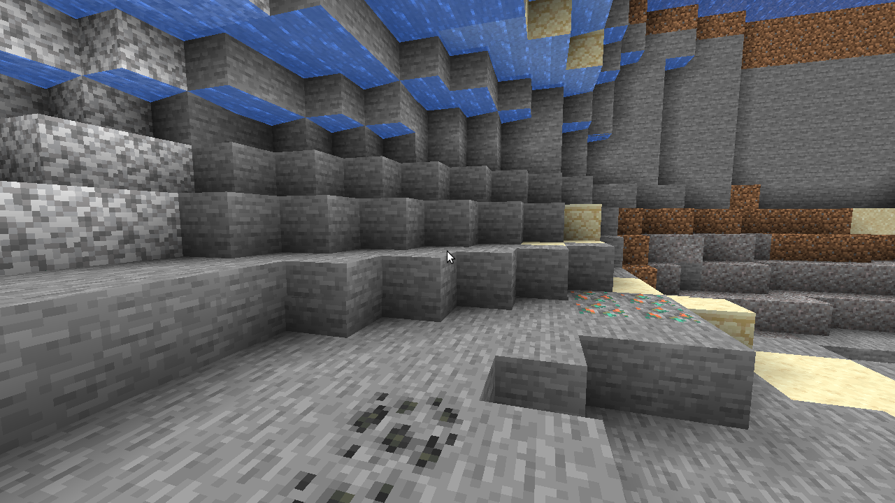
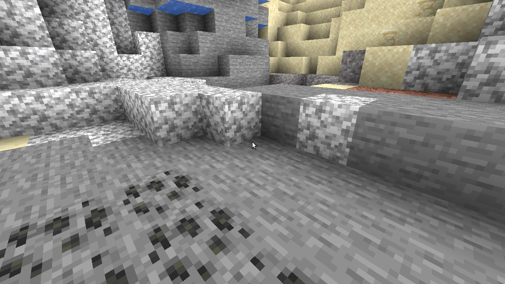
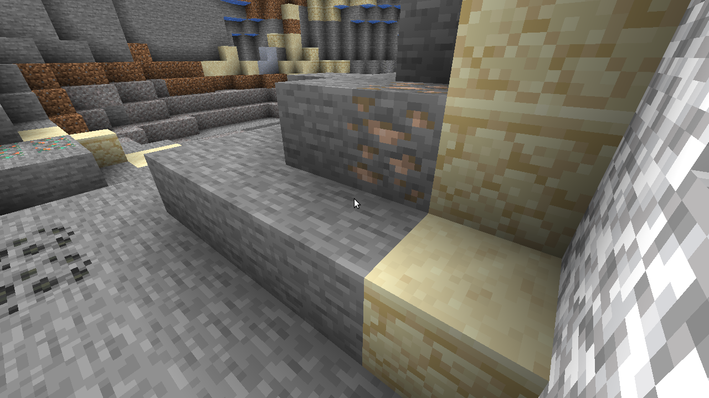

# Carry On

Pick up mobs, chests, spawners, and other tile entities with your bare hands!

## Features

- **Sneak + Right-click** on a block entity (chest, furnace, spawner, barrel, hopper, etc.) or a mob to pick it up
- Walk **slower while carrying** - the weight slows you down!
- **Sneak + Right-click** again to place down what you're carrying
- **Cannot attack or use items** while carrying - your hands are full!
- Works with chests, furnaces, spawners, hoppers, barrels, shulker boxes, brewing stands, beehives, and more
- Pick up almost any mob (except bosses like the Ender Dragon and Wither)
- All inventory contents are preserved when carrying block entities

## Screenshots







## Requirements

- Minecraft 1.21.1
- Fabric Loader 0.16.0 or higher
- Fabric API

## Installation

1. Install [Fabric Loader](https://fabricmc.net/use/installer/)
2. Download [Fabric API](https://modrinth.com/mod/fabric-api) and place it in your `mods` folder
3. Download the latest `carry-on-*.jar` from the releases or the `build/libs` folder
4. Place the JAR file in your `mods` folder
5. Launch Minecraft!

## Usage

1. Make sure your main hand is empty (or it won't matter, the mod handles it)
2. **Sneak (hold shift) + Right-click** on a carryable block or mob
3. You'll see a message confirming you picked it up
4. Walk to where you want to place it (you'll be slowed down)
5. **Sneak + Right-click** on the ground or a block face to place it down

## Building from Source

```bash
git clone https://github.com/Simplifine-gamedev/carry-on.git
cd carry-on
./gradlew build
```

The built JAR will be in `build/libs/`.

## License

MIT License
